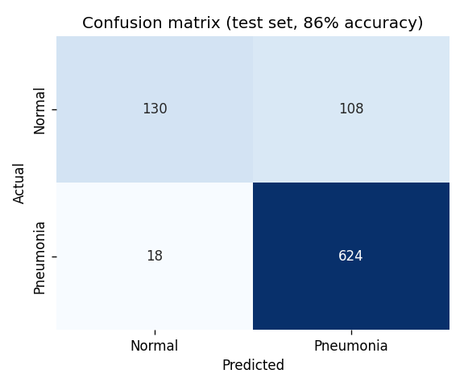

# Pneumonia Detection from Chest X-Rays

> Completed as part of **CS 7375: Artificial Intelligence** (graduate course), Kennesaw State University, Fall 2024.

A convolutional neural network built from scratch in TensorFlow/Keras that classifies chest X-ray images as Normal or Pneumonia. It reaches 86% test accuracy and catches 97% of pneumonia cases — though, as the results show, at the cost of too many false alarms on healthy lungs. Comes with a Streamlit web app for uploading an X-ray and getting a live prediction.

## The problem

Pneumonia is diagnosed largely from chest X-rays, and in places short on trained radiologists, that reading is a bottleneck. A model that flags likely pneumonia cases can help triage images and speed up diagnosis. The task here is binary: given a chest X-ray, predict Normal or Pneumonia.

I used the Kaggle Chest X-Ray Images (Pneumonia) dataset — 5,856 labeled images, split roughly 70% train, 15% validation, 15% test.

## Approach

A CNN trained from scratch rather than fine-tuned from a pretrained model. The architecture is four convolutional blocks of increasing width (32 → 64 → 128 → 256 filters), each followed by max-pooling and batch normalization, then dense layers with dropout before a sigmoid output.

Key choices:

- **Grayscale, 224×224 input.** X-rays carry no useful color, so grayscale halves the computation with no loss of signal.
- **Data augmentation** on the training set — rotation, shifts, shear, zoom, and horizontal flips — to expand effective dataset size and reduce overfitting.
- **Adam optimizer, binary cross-entropy loss, early stopping** with patience of 5 epochs, up to 50 epochs. Early stopping keeps the best validation weights and avoids overtraining.

## Results

86% accuracy on the held-out test set. The confusion matrix tells the more useful story:



| Metric | Value |
|--------|-------|
| Test accuracy | 86% |
| Recall (Pneumonia) | 0.97 |
| Recall (Normal) | 0.55 |

The model catches almost every pneumonia case — only 18 missed out of 642. But it also flags 108 of 238 healthy X-rays as pneumonia. That's the honest weakness: high sensitivity, poor specificity.

The cause is the dataset itself, which holds far more pneumonia images than normal ones. The model learned that guessing "pneumonia" is usually right, so it leans that way. For a triage tool you'd rather miss few real cases than raise no false alarms, so the bias isn't fatal — but it's the first thing I'd fix.

## Run it

The X-ray dataset is not included here (it's large and distributed under its own terms on Kaggle). Download [Chest X-Ray Images (Pneumonia)](https://www.kaggle.com/datasets/paultimothymooney/chest-xray-pneumonia) and place the folders next to the script:

```
src/
  pneumonia_cnn.py
  train/   NORMAL/  PNEUMONIA/
  val/     NORMAL/  PNEUMONIA/
  test/    NORMAL/  PNEUMONIA/
```

Then:

```bash
pip install -r requirements.txt
python src/pneumonia_cnn.py
```

It trains the model, prints test accuracy and a classification report, plots the confusion matrix and the training/validation curves, and saves the trained model as `pneumonia_cnn_model.keras`.

## Web app

The repo includes a Streamlit app that loads the trained model and lets you upload a chest X-ray for a live prediction with a confidence score. Once you've trained the model (the step above), launch it with:

```bash
streamlit run app.py
```

It opens in your browser. Drop in an X-ray image and it returns Normal or Pneumonia, the confidence, and the raw model probability. The app refuses to run until a trained model file exists, and it carries a clear disclaimer that it's a learning project, not a diagnostic tool.

## Deploying a live demo (optional)

To put a working demo online for free, push this repo to GitHub and connect it to [Streamlit Community Cloud](https://streamlit.io/cloud), pointing it at `app.py`. The catch: the hosted app needs the trained model file, which `.gitignore` excludes by default. After training locally, force-add it once:

```bash
git add -f src/pneumonia_cnn_model.keras
git commit -m "Add trained model for the demo"
git push
```

The model is around 25 MB, well under GitHub's limit. A live demo link on your portfolio is worth far more than a screenshot.

## What I'd improve

The class imbalance is the main issue. Class weights or oversampling the normal images would push specificity up without sacrificing much recall. Beyond that, transfer learning from a network pretrained on medical or natural images would likely beat training from scratch on a dataset this size, and L2 regularization would help the validation curve, which currently fluctuates more than the training curve.

## Notes

The dataset is the public Kaggle Chest X-Ray Images (Pneumonia) set (Kermany et al.), not redistributed here.
